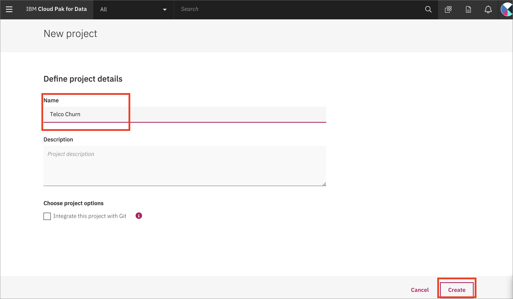
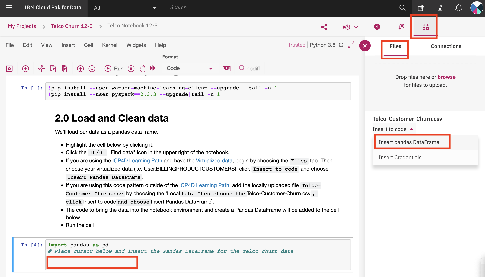

# Predict Customer Churn using Watson Machine Learning and Jupyter Notebooks on Cloud Pak for Data

In this Code Pattern, we use IBM Cloud Pak for Data (ICP4D) to go through the whole data science pipeline to solve a business problem and predict customer churn using a Telco customer churn dataset. Cloud Pak for Data is an interactive, collaborative, cloud-based environment where data scientists, developers, and others interested in data science can use tools (e.g., RStudio, Jupyter Notebooks, Spark, etc.) to collaborate, share, and gather insight from their data as well as build and deploy machine learning and deep learning models.

When the reader has completed this Code Pattern, they will understand how to:

* Use [Jupyter Notebooks](https://jupyter.org/) to load, visualize, and analyze data
* Run Notebooks in [IBM Cloud Pak for Data](https://www.ibm.com/analytics/cloud-pak-for-data)
* Build, test and deploy a machine learning model using [Spark MLib](https://spark.apache.org/mllib/) on ICP4D.
* Deploy a selected machine learning model to production using Cloud Pak for Data
* Create a front-end application to interface with the client and start consuming your deployed model.


## Flow

1. Load the provided notebook into the Cloud Pak for Data platform.
1. [Telco customer churn data set](https://raw.githubusercontent.com/IBM/telco-customer-churn-on-icp4d/master/data/Telco-Customer-Churn.csv)  is loaded into the Jupyter Notebook, either directly from the github repo, or as [Virtualized Data] after following the [Data Virtualization Tutorial]() from the [IBM Cloud Pak for Data Learning Path]().
1. Describe, analyze and visualize data in the notebook.
1. Preprocess the data, build machine learning models and test them.
1. Deploy a selected machine learning model into production.
1. Interact and consume your model using a frontend application.

## Included components

* [IBM Cloud Pak for Data]
* [Watson Machine Learning Add On for ICP4D]

## Featured technologies

* [Jupyter Notebooks](https://jupyter.org/): An open-source web application that allows you to create and share documents that contain live code, equations, visualizations, and explanatory text.
* [Pandas](https://pandas.pydata.org/):  An open source library providing high-performance, easy-to-use data structures and data analysis tools for the Python programming language.
* [Seaborn](https://seaborn.pydata.org/): A Python data visualization library based on matplotlib. It provides a high-level interface for drawing attractive and informative statistical graphics.
* [Spark MLib](https://spark.apache.org/mllib/): Apache Spark's scalable machine learning library.

## Prerequisites

* [IBM Cloud Pak for Data](https://www.ibm.com/analytics/cloud-pak-for-data)
* [Watson Machine Learning Add On for ICP4D](https://www.ibm.com/support/producthub/icpdata/docs/content/SSQNUZ_current/com.ibm.icpdata.doc/zen/admin/add-ons.html#add-ons__ai)

# Steps

1. [Create a new Project](#1-create-a-new-project)
1. [Upload the dataset](#2-upload-the-dataset) if you are not on the [ICP4D Learning Path]().
1. [Import notebook to Cloud Pak for Data](#3-import-notebook-to-cloud-pak-for-data)
1. [Import dataset into the notebook](#4-import-dataset-into-the-notebook)
1. [Follow the steps in the notebook](#5-follow-the-steps-in-the-notebook)
1. [Either Deploy to IBM Cloud or Deploy locally](#6-either-deploy-to-ibm-cloud-or-deploy-locally)

    6a. [Deploy to IBM Cloud](#6a-deploy-to-ibm-cloud)

    6b. [Deploy locally](#6b-deploy-locally)

## 1. Create a new project

Launch a browser and navigate to your Cloud Pak for Data deployment

Go the (☰) menu and click *Projects*


Click on *New project*


Create a new project, choose `Analytics project`, give it a unique name, and click *OK. Click `Create` on the next screen.



## 2. Upload the dataset

If you are not on the [ICP4D Learning Path], which uses Virtualized Data, upload the dataset into your project now.

Clone this repository:

```bash
git clone https://github.com/IBM/telco-customer-churn-on-icp4d/
cd telco-customer-churn-on-icp4d
```

In your project, choose `Data sets` from the left-hand menu, and then click `+Add Data set`:


Either drag the `Telco-Customer-Churn.csv` file to the window or navigate to it using `Select from your local file system`:


## 3. Import notebook to Cloud Pak for Data

At the project overview click the *New Asset* button, and choose *Add notebook*.


On the next panel select the *From URL* tab, give your notebook a name, provide the following URL, and choose the Python 3.6 environment:

```bash
https://raw.githubusercontent.com/IBM/telco-customer-churn-on-icp4d/master/notebooks/Telco-customer-churn-ICP4D.ipynb
```


When the Jupyter notebook is loaded and the kernel is ready then we can start executing cells.


### 4. Import dataset into the notebook

Spend a minute looking through the sections of the notebook to get an overview.

In section `2.0 Load and Clean data`, highlight the cell labelled `# Place cursor ...` by clicking on it. Click on the *10/01* button to select a specific data set.

If you are following the [Learning Path](), Choose The *Remote* tab, and pick the virtualized data set that has all three joined tables (i.e. `User999.billing+products+customers`), and choose `Insert Pandas DataFrame`.


If you are running this pattern alone, choose the *Local* tab, and choose the 'Telco-Customer-Churn.csv` file that you added, then choose `Insert Pandas DataFrame`:



By adding data a block of code will be added to the notebook. The code will automatically load that data set and create a Pandas DataFrame.


> **IMPORTANT**: Don't forget to update the next cell `df = df1` with the variable from the generated code.

### 5. Follow the steps in the notebook

You will run cells individually by highlighting each cell, then either click the `Run` button at the top of the notebook. While the cell is running, an asterisk (`[*]`) will show up to the left of the cell. When that cell has finished executing a sequential number will show up (i.e. `[17]`).

Continue to run the remaining cells in the section to clean the data.

#### Create the model

Section `3.0 Create a model` will split the data into training and test data, and create a model using the Random Forest Classifier algorithm.


Continue to run the remaining cells in the section to build the model.

#### Save the model

Section `4.0 Save the model` will save the model to your project. Update the `MODEL_NAME` variable to something unique and easisly identifiable.

```python
MODEL_NAME = "user123 customer churn model"
```

Continue to run the remaining cells in the section to save the model to Cloud Pak for Data. We'll be able to test it out with the Cloud Pak for Data tools in just a few minutes!

# Sample output

# Links

# Learn more
* **Artificial Intelligence Code Patterns**: Enjoyed this Code Pattern? Check out our other [AI Code Patterns](https://developer.ibm.com/technologies/artificial-intelligence/).
* **Data Analytics Code Patterns**: Enjoyed this Code Pattern? Check out our other [Data Analytics Code Patterns](https://developer.ibm.com/technologies/data-science/)
* **AI and Data Code Pattern Playlist**: Bookmark our [playlist](https://www.youtube.com/playlist?list=PLzUbsvIyrNfknNewObx5N7uGZ5FKH0Fde) with all of our Code Pattern videos
* **With Watson**: Want to take your Watson app to the next level? Looking to utilize Watson Brand assets? [Join the With Watson program](https://www.ibm.com/watson/with-watson/) to leverage exclusive brand, marketing, and tech resources to amplify and accelerate your Watson embedded commercial solution.
* **IBM Watson Studio**: Master the art of data science with IBM's [Watson Studio](https://www.ibm.com/cloud/watson-studio)

# License
This code pattern is licensed under the Apache Software License, Version 2.  Separate third party code objects invoked within this code pattern are licensed by their respective providers pursuant to their own separate licenses. Contributions are subject to the [Developer Certificate of Origin, Version 1.1 (DCO)](https://developercertificate.org/) and the [Apache Software License, Version 2](https://www.apache.org/licenses/LICENSE-2.0.txt).

[Apache Software License (ASL) FAQ](https://www.apache.org/foundation/license-faq.html#WhatDoesItMEAN)
